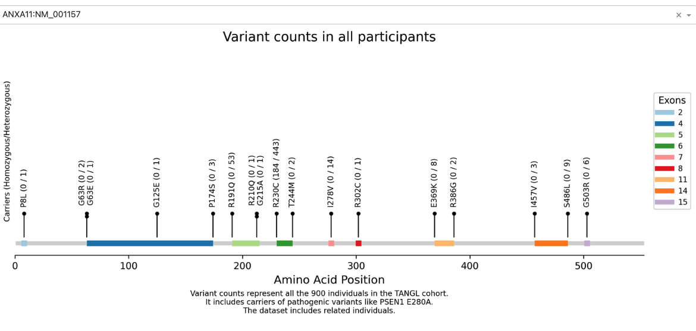

[](https://doi.org/10.5281/zenodo.15652735)

# Variant Visualizer

A Dash-based web application to visualize case/control variant counts. You may generate graphs from our predefined datasets or upload custom `.txt` files yourself. We have used it to plot the allelic counts of variant in neurodegeneration associated genes in the TANGL and ReDLat cohorts



## Contents

- [Introduction](#introduction)
- [Generating the `.txt` Files](#generating-the-txt-files)
- [Installation](#installation)
- [Running the App](#running-the-app)
- [App Structure](#app-structure)
- [Usage](#usage)
- [Citations](#citations)

---

## Introduction

This application reads variant data from tab-delimited files named after genes (e.g., `PSEN1`, `MAPT`). Each file contains columns for exon number, amino-acid position (AA), variant identifier, and case/control counts, including subgroup counts (e.g., AD, EOD, FTLD, AAO<65, Healthy). It clusters nearby variants within the same exon, renders vertical lines and scatter points to represent counts, and draws exon-range bars with a legend.

## Generating the Files

Each gene file must be tab-delimited with no file extension. Here's an example of the content inside a file (e.g., `ABCA7`):

```text
| Gene.refGene | Variant | AA  | Exon | all.Hom_A1 | all.Het | ad.Hom_A1 | ad.Het | ftd.Hom_A1 | ftd.Het | aao.Hom_A1 | aao.Het | healthy.Hom_A1 | healthy.Het |
|--------------|---------|-----|------|------------|---------|-----------|--------|------------|---------|-------------|---------|------------------|--------------|
| ANXA11       | G503R   | 503 | 15   | 0          | 3       | 0         | 3      | 0          | 0       | 0           | 0       | 0                | 0            |
| ANXA11       | S486L   | 486 | 14   | 0          | 4       | 0         | 3      | 0          | 0       | 0           | 0       | 0                | 0            |
| ANXA11       | I457V   | 457 | 14   | 0          | 15      | 0         | 7      | 0          | 6       | 0           | 0       | 0                | 0            |
| ANXA11       | I406V   | 406 | 12   | 0          | 1       | 0         | 1      | 0          | 0       | 0           | 0       | 0                | 0            |
| ANXA11       | R386G   | 386 | 11   | 0          | 2       | 0         | 2      | 0          | 0       | 0           | 0       | 0                | 0            |

```

These gene-named files can be generated using `extract_variants.py`:

```bash
# Extract tangl variants
python ./data_preprocessing/extract_variants.py \
  --input data/tangl/tangl_id.hg38_multianno.annotated-variant-counts.tsv \
  --isoforms '{
      "ANXA11": "NM_001157",
      "APOE":  "NM_000041",
      "APP":   "NM_000484",
      "CHMP2B":"NM_014043",
      "CSF1R": "NM_005211",
      "DNAJC5":"NM_025219",
      "FUS":   "NM_001170634",
      "GRN":   "NM_002087",
      "LRRK2": "NM_198578",
      "MAPT":  "NM_005910",
      "NOTCH3":"NM_000435",
      "PSEN1": "NM_000021",
      "PSEN2": "NM_000447",
      "RELN":  "NM_005045",
      "SOD1":  "NM_000454",
      "SQSTM1":"NM_003900",
      "TARDBP":"NM_007375",
      "TBK1":  "NM_013254",
      "TREM2": "NM_018965",
      "VCP":   "NM_007126"
  }' \
  --output-dir data/tangl
```

## Installation

1. **Clone** this repository:

   ```bash
   git clone https://github.com/ThePickleGawd/variant-visualizer.git
   cd variant-visualizer
   ```

2. **Create** a virtual environment and install dependencies:
   ```bash
   python -m venv .venv
   source .venv/bin/activate
   pip install -r requirements.txt
   ```
   You need to have Python ≥ 3.11 installed. If you do `python --version` inside that environment and it’s < 3.11, follow the next step.

3. **Install & use Python 3.11 for your venv**  

   – **Install Python 3.11** (to get the `python3.11` binary). For example, with Homebrew on an Intel Mac:  
     ```bash
     brew install python@3.11
     ```  
     This will give you a `python3.11` executable (typically at `/usr/local/opt/python@3.11/libexec/bin/python3`).

   – **Recreate your venv using that binary**:  
     ```bash
     rm -rf .venv
     /usr/local/opt/python@3.11/libexec/bin/python3 -m venv .venv
     source .venv/bin/activate
     pip install --upgrade pip    # optional but recommended
     pip install -r requirements.txt
     ```

4. **Verify**  
   ```bash
   python --version   # → Python 3.11.x
   pip list           # shows your project’s dependencies
   ```

## Running the App

```bash
# Deploy/Run locally
gunicorn app:server --bind 0.0.0.0:8050
```

By default, the app runs on `http://127.0.0.1:8050`.

---

## Usage

1. Select a dataset tab (Currently only `TANGL`).
2. Choose a category
3. Choose a file from the dropdown.
4. View the generated plot below.

## Developed by:

- Dylan Lu `dylanlu@ucsb.edu`
- Juliana Acosta-Uribe `acostauribe@ucsb.edu`

## Citations

If you use any of our data, please cite us:

- **TANGL**: Acosta-Uribe, J., Aguillón, D., Cochran, J. N., Giraldo, M., Madrigal, L., Killingsworth, B. W., ... & Kosik, K. S. (2022). _A neurodegenerative disease landscape of rare mutations in Colombia due to founder effects._ Genome Medicine, 14(1), 27.
- **ReDLat**: Acosta-Uribe, J., Escudero, S. D. P., Cochran, J. N., Taylor, J. W., Castruita, P. A., Jonson, C., ... & Yokoyama, J. S. (2024). _Genetic Contributions to Alzheimer’s Disease and Frontotemporal Dementia in Admixed Latin American Populations._ medRxiv.
