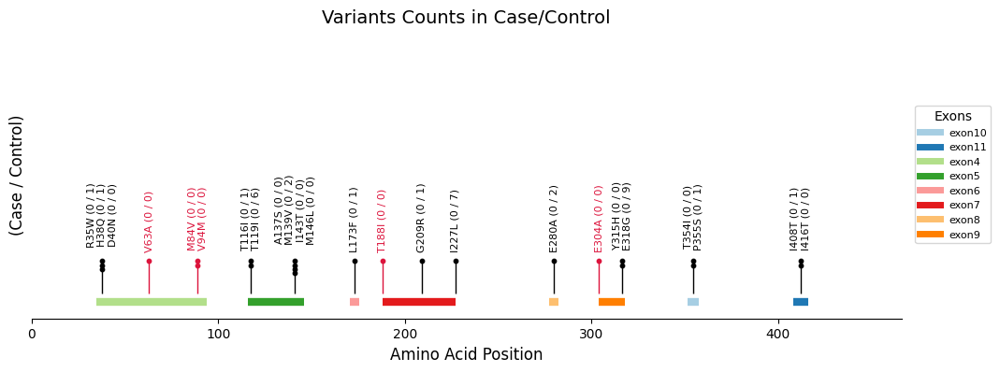

# Variant Visualizer

A Dash-based web application to visualize case/control variant counts. You may generate graphs from our predefined datasets or upload custom `.txt` files yourself.



## Contents

- [Introduction](#introduction)
- [Generating the `.txt` Files](#generating-the-txt-files)
- [Installation](#installation)
- [Running the App](#running-the-app)
- [App Structure](#app-structure)
- [Usage](#usage)
- [Citations](#citations)

---

## Introduction

This application reads variant data from tab-delimited files named after genes (e.g., `PSEN1`, `MAPT`). Each file contains columns for exon number, amino-acid position (AA), variant identifier, and case/control counts, including subgroup counts (e.g., AD, EOD, FTLD, AAO<65, Healthy). It clusters nearby variants within the same exon, renders vertical lines and scatter points to represent counts, and draws exon-range bars with a legend.

## Generating the Files

Each gene file must be tab-delimited with no file extension. Here's an example of the content inside a file (e.g., `ABCA7`):

```text
Gene.refGene	variant	AA	exon	het_case	hom_case	het_control	hom_control	ad_het	ad_hom	eod_het	eod_hom	ftld_het	ftld_hom	aao65_het	aao65_hom	healthy_het	healthy_hom
ABCA7	N79T	79	exon4	0	3	0	1	0	3	0	0	0	0	0	2	0	0
```

These gene-named files can be generated using `extract_variants.py`:

```bash
# Extract tangl variants
python extract_variants.py \
 --input raw_data/tangl/tangl.tsv \
 --isoforms '{"ABCA7": "NM_019112", "ADAM10": "NM_001110", "ANXA11": "NM_001157", "APOE": "NM_000041", "APP": "NM_000484", "C9ORF72": "NM_001256054", "CHMP2B": "NM_014043", "CSF1R": "NM_005211", "DNAJC5": "NM_025219", "FIG4": "NM_014845", "FOXL2": "NM_023067", "FUS": "NM_001170634", "GJB2": "NM_004004", "GRN": "NM_002087", "HNRNPA2B1": "NM_002137", "KIF1A": "NM_004321", "LRRK2": "NM_198578", "MAPT": "NM_005910", "NOTCH3": "NM_000435", "PSEN1": "NM_000021", "PSEN2": "NM_000447", "SCN1A": "NM_001165963", "SOD1": "NM_000454", "SQSTM1": "NM_003900", "TARDBP": "NM_007375", "TBK1": "NM_013254", "TREM2": "NM_018965", "UBQLN2": "NM_013444", "VCP": "NM_007126"}' \
 --output-dir data/tangl

```

---

## Installation

1. **Clone** this repository:

   ```bash
   git clone https://github.com/ThePickleGawd/variant-visualizer.git
   cd variant-visualizer
   ```

2. **Create** a virtual environment and install dependencies:
   ```bash
   python -m venv .venv
   source .venv/bin/activate
   pip install -r requirements.txt
   ```

## Running the App

```bash
# Test locally
python app.py

# Deploy
gunicorn app:server --bind 0.0.0.0:8050
```

By default, the app runs on `http://127.0.0.1:8050`.

---

## Usage

1. Select a dataset tab (Currently only `TANGL`).
2. Choose a category
3. Choose a file from the dropdown.
4. View the generated plot below.

## Citations

If you use any of our data, please cite us:

- **TANGL**: Acosta-Uribe, J., Aguillón, D., Cochran, J. N., Giraldo, M., Madrigal, L., Killingsworth, B. W., ... & Kosik, K. S. (2022). _A neurodegenerative disease landscape of rare mutations in Colombia due to founder effects._ Genome Medicine, 14(1), 27.
- **ReDLat**: Acosta-Uribe, J., Escudero, S. D. P., Cochran, J. N., Taylor, J. W., Castruita, P. A., Jonson, C., ... & Yokoyama, J. S. (2024). _Genetic Contributions to Alzheimer’s Disease and Frontotemporal Dementia in Admixed Latin American Populations._ medRxiv.

```

```
